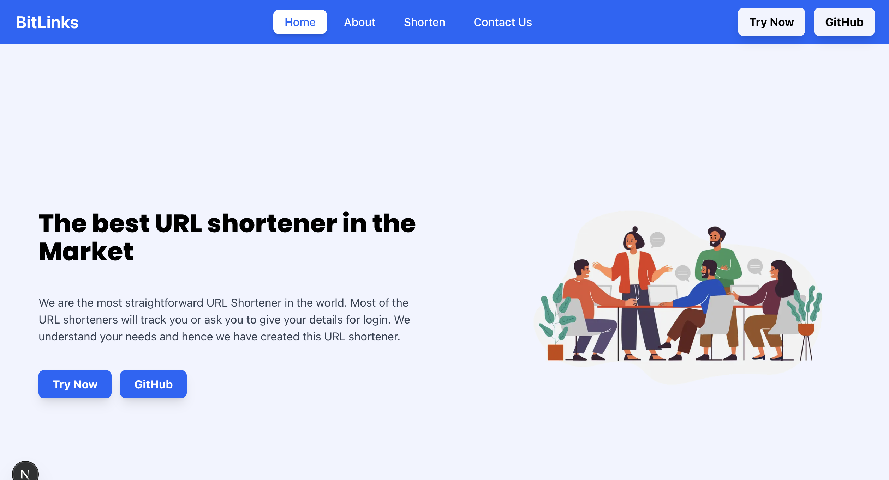
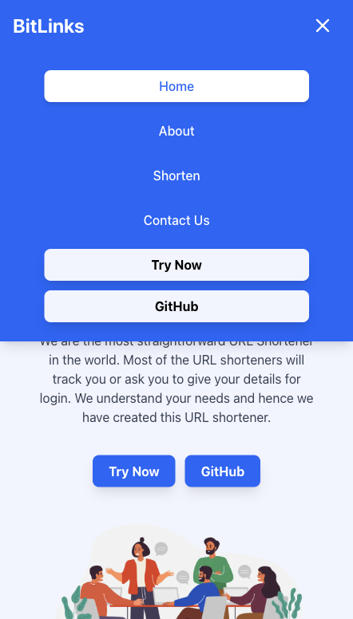

# 🔗 BitLinks – Modern URL Shortener

BitLinks is a **Next.js 14** powered web application that allows users to shorten long URLs into neat, shareable links.  
It features a clean UI, responsive design, dynamic routing, and a professional developer experience.

---

## 🚀 Features

- ✨ **Shorten URLs** – Generate unique short links with ease.  
- 📱 **Responsive UI** – Fully optimized for mobile, tablet, and desktop.  
- 🧭 **Dynamic Routing** – Uses `[shorturl]` in `app/` to handle redirections seamlessly.  
- 🖥️ **Pages** – Includes Home, About, Contact, and Shorten pages with a consistent theme.  
- 🎨 **Styled with TailwindCSS** – Clean, modern, and customizable design.  
- ⚡ **Next.js App Router** – Built using the latest Next.js `app/` directory structure.  

---

## 📂 Project Structure

```
bitlinks/
├── app/
│   ├── [shorturl]/     # Dynamic route for redirecting short links
│   ├── about/          # About page
│   ├── contact/        # Contact page
│   ├── shorten/        # URL shortener form
│   ├── api/            # API routes for backend logic
│   ├── layout.js       # Global layout
│   ├── page.js         # Home page
│   ├── globals.css     # Global styles
├── components/         # Reusable React components
├── public/             # Static assets (icons, images, etc.)
├── lib/                # Utility functions & helpers
├── package.json

```

## 🛠️ Tech Stack

- Framework: Next.js 14
 (App Router)

- Styling: TailwindCSS

- State & Routing: Next.js Dynamic & Static Routes

- Utilities: PostCSS, ESLint

- Deployment: Vercel / Any Node.js hosting

## ⚡ Dynamic Routing in Action

BitLinks uses Next.js Dynamic Routes:

```
app/[shorturl]/page.js
```

Each shortened URL generates a dynamic route.

When a user visits https://yourdomain.com/xyz123,
Next.js captures xyz123 via [shorturl] and redirects to the original long URL.

This makes the system scalable and SEO-friendly.

## 📸 Screenshots (Optional)

### Desktop View


### Mobile View



## 🚀 Getting Started
- Clone the repository
git clone https://github.com/your-username/bitlinks.git
```
cd bitlinks
```

- Install dependencies
```
npm install
```

- Run the development server
```
npm run dev
```

- Now open http://localhost:3000

## 📬 Contact

👨‍💻 Developed by Bhanu Murari
🔗 GitHub: Bhanu Sankarasetty
📧 Email: bhanuchiru619@gmail.com 